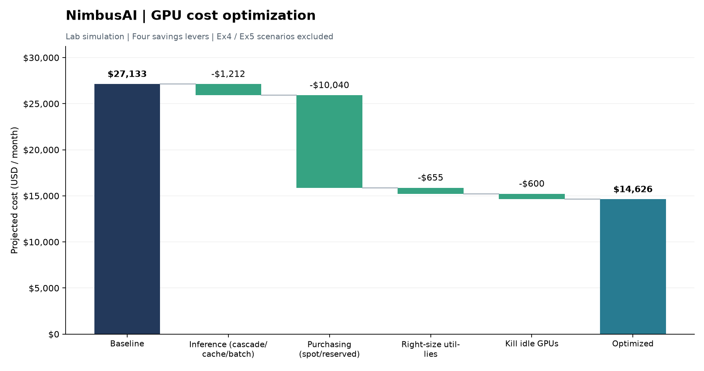

# NimbusAI — GPU Cost Optimization Report

**Student:** Nguyễn Thiên Lộc  
**Student ID:** 2A202601479  
**Class:** Cohort 3 · Track 2

**Period:** monthly  
**Baseline spend:** $27,133  
**Optimized spend:** $14,626  
**Projected savings:** $12,507  (**46%**)

## Savings by lever

| Lever | Savings (USD) |
|---|---|
| Inference (cascade/cache/batch) | $1,212 |
| Purchasing (spot/reserved) | $10,040 |
| Right-size util-lies | $655 |
| Kill idle GPUs | $600 |

## Sustainability

- Energy per query: 0.24 Wh
- Carbon per query: 0.091 gCO2e
- Lowest-carbon region: europe-north1
- Lowest electricity-price region: us-east-wa

_Figures are June-2026 as-of snapshots; re-baseline before acting._

Sustainability snapshot: one illustrative 800-token normal query at us-east-1; not the traffic-wide average.

## Inference unit economics (M2)

Baseline: $6.488/1M-token; optimized: $1.126/1M-token (82.6% saved). Both use the same 7,533,027 daily input + output tokens.

## Technical analysis and recommendations

### 1. Scope, data and reporting periods

This submission uses synthetic data with seed=25 and the repository's illustrative June 2026 prices. No models or physical GPUs were deployed and no cloud charges were incurred. Optimization means comparing modeled cost scenarios; performance, answer quality and emissions have not been measured on hardware.

M2 covers one day of requests; M3/M5 normalize costs to 30 days. Ex4 uses the same daily traffic as M2; Ex5 uses each job's own duration. All monetary values are USD; commas separate thousands and periods mark decimals.

### 2. M1 — GPU activity versus useful computation

MFU = achieved_tflops / peak_tflops; MBU = achieved_bw_tbs / peak_bw_tbs. The lab flags GPUs with GPU-Util >=90% but MFU <30%:

| GPU | GPU-Util | MFU | MBU | On-demand USD/hour |
|---|---:|---:|---:|---:|
| gpu-h100-4 | 98.2% | 19.4% | 20.7% | 2.50 |
| gpu-a10g-1 | 96.9% | 26.8% | 30.2% | 1.00 |

GPU-Util reflects time with GPU activity, not the fraction of useful FLOPs delivered. An active kernel may perform little computation because it waits for data, handles small tasks, or does not use tensor cores effectively. These are hypotheses requiring profiling, not root causes established by this CSV. Low MFU can also be expected for memory-bound work; MFU alone is insufficient for right-sizing.

Idle waste is $20.00/day, or $600/30 days (2.21% of the M5 baseline budget). This denominator is the lab's combined budget, not a standalone bill for the telemetry fleet. GPU gpu-h100-5 has 8 idle hours/day. Rental savings require releasing resources or otherwise stopping their billing, not merely stopping computation.

M5 also assumes the following cheaper GPU substitutions for flagged devices:

| GPU | Current → sample recommendation | Difference USD/hour | Potential USD/30 days |
|---|---|---:|---:|
| gpu-h100-4 | H100 → A100 | 0.71 | 511.20 |
| gpu-a10g-1 | A10G → L4 | 0.20 | 144.00 |

Right-sizing savings are rental-price estimates only. Validate VRAM capacity, bandwidth, throughput and latency before accepting a substitution; 20% MFU does not imply that 80% of the bill can be removed.

### 3. M2 — Contribution of each inference lever

Keep the same 7,533,027 input + output tokens. Apply baseline → cascade → add cache → add batch; each row introduces one additional lever:

| Stage | Cost USD/day | USD/1M-token | Incremental savings USD/day |
|---|---:|---:|---:|
| Baseline | 48.8742 | 6.488 | 0.0000 |
| Cascade | 11.4756 | 1.523 | 37.3985 |
| + Cache | 10.2792 | 1.365 | 1.1965 |
| + Batch | 8.4846 | 1.126 | 1.7946 |

Cascade is the largest M2 contributor: $37.3985/day, or 92.59% of inference savings under this attribution order. Small-model prices are lower and many dataset requests have route_tier=small. Those routing labels are supplied by the dataset; they do not establish that the small model provides equivalent answer quality.

Marginal contributions depend on the application order because cache and batch interact with model prices. Do not add three standalone percentage estimates. Cache discounts only cached input tokens, while batch discounts requests marked is_batch. The 0.05 discount_stack factor applies to fully cached input combined with batch, not a guaranteed 95% discount for every whole request. Avoid batch when deadlines or interactive response requirements cannot tolerate waiting.

### 4. M3 — Purchasing strategy and commitment limits

Modeled GPU rental spend falls from $25,667 to $15,627/month (39.1%). Interruptible jobs running less than 24 hours/day use spot; remaining jobs with duty cycle >=55% use reserved. Spot estimates include checkpoint and rework overhead through the supplied function.

The 55% threshold comes from an assumed 45% reserved discount; it is not universal across GPUs. M3 normalizes every job to 30 days and multiplies reserved rates by workload hours. It does not fully model obligations across a one-/three-year commitment or unused committed capacity. Before reserving, evaluate actual duration, forecast utilization and opportunity cost. Use spot only when jobs can resume from checkpoints and still meet deadlines after interruptions.

### 5. M4 — Cost allocation and tag quality

| Team | Cost USD/day |
|---|---:|
| assistant | 2.59 |
| search | 2.49 |
| eval | 1.79 |
| rag | 1.60 |

Tag coverage is 91.8% (rounded to 92% in console output), above the lab's 80% threshold, so the chargeback gate is open. The assistant team spends the most, but this does not establish waste without normalization by requests or tokens. Rounding costs by team can cause cent-level differences from the M2 total.

Start with showback, complete missing project tags, then introduce actual chargeback with transparent rules for untagged spend. focus_export.csv is a 50-row FOCUS-style sample, not an export of all 2,400 requests or certification of complete FOCUS compliance.

### 6. M5 — Combined savings, priorities and overlap risks

Projected savings total $12,507/month, or 46.1%. M5 combines 30 days of inference spending with the M3 GPU budget, then subtracts four savings buckets as implemented in the starter code. M2 uses unrounded totals for USD/1M-token; M5 preserves the starter's rounding, so recomputing from displayed values may produce small differences.

| Lever | Savings USD/month | Share of total savings |
|---|---:|---:|
| Inference (cascade/cache/batch) | 1,212 | 9.69% |
| Purchasing (spot/reserved) | 10,040 | 80.28% |
| Right-size util-lies | 655 | 5.24% |
| Kill idle GPUs | 600 | 4.80% |

**Three priority actions for NimbusAI:**

1. **Control idle resources and ownership first:** assign owner/team/project tags and schedule idle sandbox/GPU reclamation after checking dependencies. Track MFU/MBU and team budgets. This is a reversible change that can reduce idle waste without changing model quality.
2. **Optimize purchasing:** pilot spot with checkpointing for suitable jobs; verify steady demand and commitment obligations before reserving. Purchasing is the largest M5 savings opportunity, but implementation costs are not available to calculate actual ROI.
3. **Evaluate inference and resource changes:** validate quality before expanding cascade; cache reused prefixes and batch requests that do not require immediate responses. Profile flagged GPUs before right-sizing; compare answer quality, p95 latency, throughput and USD/1M-token before/after.

**These buckets are not audited savings:** the dataset lacks a complete gpu_id → job_id mapping to rule out overlap between M1 telemetry and M3 workloads. Establish a common cost ledger before adding purchasing, right-sizing and idle savings in production. M5 also combines token-priced inference with GPU spending; verify that these are separate charges before applying the model to real bills. The starter totals are retained for lab comparison, not as evidence of an actual cloud-bill reduction.

### 7. Interpretation of the two extensions

**Ex4:** reasoning accounts for 8.375% of requests, 16.46% of spend and 94.04% of modeled energy. A 10% cap changes nothing; a 5% cap reroutes 81 requests to normal processing, saving $0.2261/day (2.67%) and 7879.63 Wh/day (24.88%). The scenario assumes output tokens fall sixfold and removes the 80x energy multiplier after rerouting; equivalent answer quality is not established. The proposed complexity >=0.8 rule is unvalidated; the simulation instead uses observed output length as an offline proxy.

**Ex5:** 5 eligible jobs consume an estimated 1,789 kWh at catalog power. Moving from us-east-1 to europe-north1 avoids 626.15 kg CO2e (92.11%) and saves $53.67 in electricity (25.00%). us-east-wa has the lowest price; europe-north1 has the lowest carbon intensity. us-east-wa is the cheapest option below the 100 gCO2e/kWh limit. Consider latency, data residency, egress, GPU availability and deadlines. Do not add Ex5 electricity savings to rental savings: electricity may already be included in rent, and the reporting periods differ.

Detailed tables and reproducible assumptions for both extensions follow below. The opening sustainability snapshot represents one 800-token normal query in us-east-1, not the traffic average. Region names are retained as dataset labels; no geographic mapping or current market-price claim is implied.

### 8. Reproduction and source cross-checks

```powershell
python data/generate.py
python missions/run_all.py
python missions/ex5_carbon_scheduling.py
python verify.py
pytest -q
```

M5 regenerates report.md, writeup.md and savings.png; M4 writes focus_export.csv. Original instructor tests remain unchanged; additional tests are in separate files. Prices and formulas come from the lab's data/, finops/ and missions/ directories; submission requirements are cross-checked against README.md, Guide.md and Rubric.md.

## Extension 4 - Reasoning budget

Daily traffic; costs include existing model routing, cache and batch discounts.
Energy values are estimates from the lab model, not hardware measurements.

| Group | Requests | Traffic % | Tokens | Cost USD | Cost % | Energy Wh | Energy % |
|---|---:|---:|---:|---:|---:|---:|---:|
| normal | 2,199 | 91.625 | 6,291,871 | 7.0882 | 83.54 | 1887.56 | 5.96 |
| reasoning | 201 | 8.375 | 1,241,156 | 1.3965 | 16.46 | 29787.74 | 94.04 |

Reasoning represents 8.375% of requests, 16.46% of spend and 94.04% of energy.
At the SAME token count, normal processing of the reasoning group would use 372.35 Wh versus 29787.74 Wh: an estimated 29415.40 Wh reasoning overhead. The lab's 80x multiplier applies only to energy; there is no separate reasoning price multiplier in request_cost().

### Counterfactual caps (relative to current optimized M2 traffic)

| Scenario | Reasoning requests | Rerouted | Cost USD/day | Saved USD/day | Saved cost % | Energy Wh/day | Saved Wh/day | Saved energy % |
|---|---:|---:|---:|---:|---:|---:|---:|---:|
| Current | 201 | 0 | 8.4846 | 0.0000 | 0.00 | 31675.31 | 0.00 | 0.00 |
| Cap 10% | 201 | 0 | 8.4846 | 0.0000 | 0.00 | 31675.31 | 0.00 | 0.00 |
| Cap 5% | 120 | 81 | 8.2585 | 0.2261 | 2.67 | 23795.67 | 7879.63 | 24.88 |

### Routing rule and assumptions

- Proposed online rule: use normal processing by default; allow reasoning only when an independently calibrated complexity score is >= 0.8 and the daily reasoning budget has room. The threshold is a proposal, not measured in this dataset.
- Offline simulation: retain reasoning for requests with the largest observed output counts (ties follow CSV order). Output length is only a proxy and is unavailable before an online request; no complexity/confidence or quality labels are provided.
- Keep every request, model tier, input, cached input and batch flag unchanged. For rerouted requests, divide output tokens by 6 (round up), following data/generate.py, and use normal energy. This assumption reduces the number of delivered tokens; equivalent answer quality is NOT established.
- Cost savings come from fewer billed output tokens; energy savings additionally remove the reasoning multiplier. These are separate effects, not an 80x dollar discount.
- A cap above the observed reasoning share changes nothing. Caps apply to request count, not token count. The 5% scenario is a sensitivity check, not a validated policy.
- Evaluate answer quality, latency and fallback rate before adopting a tighter cap. Scenario savings are NOT added to M5's existing savings totals or chart.

## Extension 5 - Carbon-aware scheduling

Eligible jobs: 5; excluded non-interruptible jobs: 3.
Period: each job's own duration (days column), NOT a normalized month.
Energy = catalog watts x GPU count x hours/day x job days.
Total estimated GPU energy: 1,789.00 kWh.

### Per-job carbon: us-east-1 -> europe-north1

| Job | Days | Energy kWh | Baseline gCO2e | Cleanest gCO2e | Saved gCO2e |
|---|---:|---:|---:|---:|---:|
| job-train-llm | 14 | 1,568.00 | 595,840.00 | 47,040.00 | 548,800.00 |
| job-train-embed | 5 | 80.00 | 30,400.00 | 2,400.00 | 28,000.00 |
| job-finetune | 3 | 25.20 | 9,576.00 | 756.00 | 8,820.00 |
| job-dev-sandbox | 22 | 52.80 | 20,064.00 | 1,584.00 | 18,480.00 |
| job-batch-eval | 30 | 63.00 | 23,940.00 | 1,890.00 | 22,050.00 |

### Same eligible jobs in all five catalog regions

| Region | USD/kWh | gCO2e/kWh | Electricity USD | Carbon gCO2e |
|---|---:|---:|---:|---:|
| europe-central2 | 0.180 | 660 | 322.0200 | 1,180,740.00 |
| europe-north1 | 0.090 | 30 | 161.0100 | 53,670.00 |
| us-east-1 | 0.120 | 380 | 214.6800 | 679,820.00 |
| us-east-wa | 0.055 | 90 | 98.3950 | 161,010.00 |
| us-west-2 | 0.070 | 120 | 125.2300 | 214,680.00 |

Moving all eligible jobs from us-east-1 to europe-north1:
- Estimated carbon avoided: 626,150.00 gCO2e (92.11%).
- Estimated electricity savings: $53.67 (25.00%).

### Recommendations

- Lowest electricity price: us-east-wa.
- Lowest carbon intensity: europe-north1.
- Balanced policy: cheapest region with carbon <= 100 gCO2e/kWh: us-east-wa.
- The balanced choice may equal the cheapest choice; a third distinct region is not required.

### Assumptions and limits

- Model GPU power as constant catalog watts; retain GPU type, count, runtime and workload across regions. This is not measured power or a forecast of real billing.
- Assume every eligible job initially runs in the baseline region. The CSV has no actual region column.
- Treat interruptible=1 as eligibility for this scenario, not proof that a job is portable. Verify GPU availability, data residency, dependencies and deadlines before moving it.
- Exclude CPU, networking, storage, cooling/PUE, migration and checkpoint overhead; regional rates are lab snapshots.
- A cleaner region can be farther from users or data, increasing latency and transfer cost. No latency measurements are available; prefer flexible batch jobs and validate end-to-end runtime.
- Electricity savings are separate from GPU rental savings: rental prices may already include electricity. Do not add these estimates to M3/M5 savings, especially with different time periods.

## Savings chart


